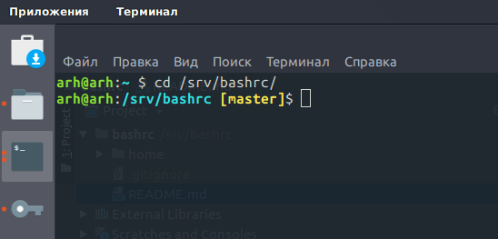
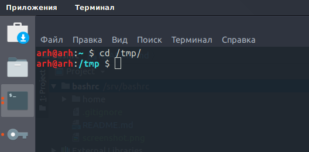

# bashrc
Цвет терминалов в linux

Правильная расцветка и отображение текущей git ветки у директории

Что бы применить текущую схему, нужно заменить содержимое файла /home/{user}/.bashrc у себя на компьютере  на содержимое файла https://github.com/AlekseyArh/bashrc/blob/master/home/develop/.bashrc

Для сервера используется немного другая расцветка https://github.com/AlekseyArh/bashrc/blob/master/home/production/.bashrc

